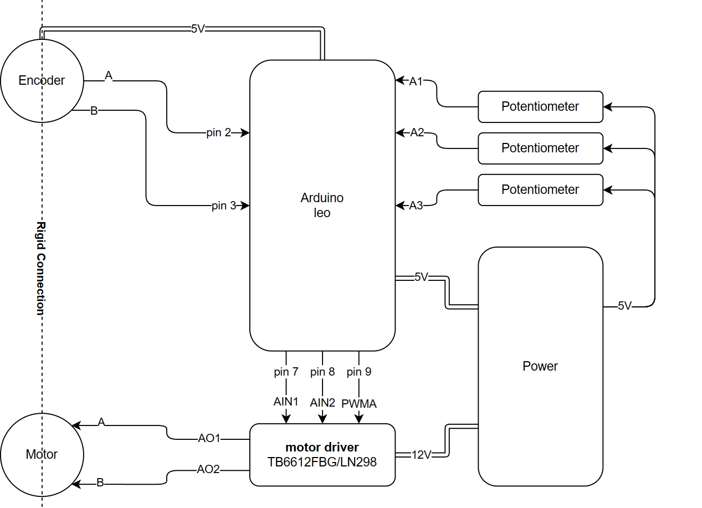

# Arduino Joystick With Force Feedback Library

## Statement

### The v1.0.0 new version library is now available, with the following major updates:

1.Fixed an issue where frame rates decrease in certain games after connecting a force feedback controller. Due to issues with the mechanism by which some games send force feedback data, the Arduino did not promptly notify the computer upon receiving the force feedback data, resulting in lost frames in these games. To resolve this problem, the reception of force feedback data has been moved to be handled within an ISR (Interrupt Service Routine) on the Arduino, which means that some interfaces have undergone changes compared to v0.9.0. Example code will be provided to demonstrate the corresponding modifications. This fix has been tested and confirmed working in games such as 'Horizon 4' and 'Horizon 5'.

2.Corrected several errors in the force feedback calculation logic.

3.A complete demonstration project has been provided for developers to reference. It can be found at the path: examples/YourFirstFFBController.

### This is a joy library for Atmega32UX chip with force feedback, which can be used to make game handle with vibration, game steering wheel with force feedback, etc.Multi-axis-force-feedback feature is added.


## Usage

### 0. example：

`examples\SingleJoystickFFB\SingleJoystickFFB.ino`

### 1. create `JoyStick` object

| params            | describe                                     |
|:------------------|:---------------------------------------------|
| REPORT_ID         | Hid report id                                |
| JOYSTICK_TYPE     | Type of devece：JOYSTICK，GAMEPAD，MULTI_AXIS |
| button count      | `[0-32]`                                     |
| Hat Switch count  | `[0,1,2]`                                    |
| X Axis enable     | True or False                                |
| Y Axis enable     | True or False                                |
| Z Axis enable     | True or False                                |
| Rx Axis enable    | True or False                                |
| Ry Axis enable    | True or False                                |
| Rz Axis enable    | True or False                                |
| Rudder enable     | True or False                                |
| Throttle enable   | True or False                                |
| Accelerator enable| True or False                                |
| Brake enable      | True or False                                |
| Steering enable   | True or False                                |

`Joystick_ Joystick(JOYSTICK_DEFAULT_REPORT_ID,JOYSTICK_TYPE_JOYSTICK,8, 0,false, true,true,false, false, false,false, false,false, false, false);`


### 2. After the object is created, the x-axis and y-axis are bound as the force feedback axis by default.The gains of various forces effect are set through the struct and the interface as following:

```
//struct of gains
struct Gains{
    uint8_t totalGain         = FORCE_FEEDBACK_MAXGAIN;
	uint8_t constantGain      = FORCE_FEEDBACK_MAXGAIN;
	uint8_t rampGain          = FORCE_FEEDBACK_MAXGAIN;
	uint8_t squareGain        = FORCE_FEEDBACK_MAXGAIN;
	uint8_t sineGain          = FORCE_FEEDBACK_MAXGAIN;
	uint8_t triangleGain      = FORCE_FEEDBACK_MAXGAIN;
	uint8_t sawtoothdownGain  = FORCE_FEEDBACK_MAXGAIN;
	uint8_t sawtoothupGain    = FORCE_FEEDBACK_MAXGAIN;
	uint8_t springGain        = FORCE_FEEDBACK_MAXGAIN;
	uint8_t damperGain        = FORCE_FEEDBACK_MAXGAIN;
	uint8_t inertiaGain       = FORCE_FEEDBACK_MAXGAIN;
	uint8_t frictionGain      = FORCE_FEEDBACK_MAXGAIN;
	uint8_t customGain        = FORCE_FEEDBACK_MAXGAIN;
};
/* set gains interface func
 * param:a <Gains> array of length 2;
 *       _gains[0]-->X_Axis_gains;
 *       _gains[1]-->Y_Axis_gains;
 * return 0 ：set gains successful
 *        -1：set gains failed
*/
int8_t setGains(Gains* _gains);
```
#### example code p1
```
#include "Joystick.h"

Joystick_ Joystick();

Gains mygains[2];

//set X Axis gains
mygains[0].totalGain = 50;
mygains[0].springGain = 80;

//set Y Axis gains
mygains[1].totalGain = 50;
mygains[1].springGain = 70;

void setup{
    //enable gains REQUIRED
    Joystick.setGains(mygains);
}

```


### 3.Set the parameters of spring effect, damper effect, inertia effect and friction effect through the struct and the interface as following:

```
//struct of Effect Params
struct EffectParams{
    //If you need to use the spring effect, set the following parameters.`Position` is the current position of the force feedback axis. 
    //For example, connect the encoder with the action axis,the current encoder value is `Positon` and the max encoder value is `MaxPosition`.
    int32_t springMaxPosition = 0;
    int32_t springPosition = 0;

    //If you need to use the damper effect, set the following parameters.`Velocity` is the current velocity of the force feedback axis.
    int32_t damperMaxVelocity = 0;
    int32_t damperVelocity = 0;

    //If you need to use the inertia effect, set the following parameters.`Acceleration` is the current acceleration of the force feedback axis.
    int32_t inertiaMaxAcceleration = 0;
    int32_t inertiaAcceleration = 0;
    
    //If you need to use the friction effect, set the following parameters.`PositionChange` is the position difference of the force feedback axis.
    int32_t frictionMaxPositionChange = 0;
    int32_t frictionPositionChange = 0;
};

/* set effect params interface func
 * param:a <EffectParams> array of length 2;
 *       _effect_params[0]-->X_Axis_params;
 *       _effect_params[1]-->Y_Axis_params;
 *
 * return 0 ：set Effect Params successful
 *        -1：set Effect Params failed
*/
int8_t setEffectParams(EffectParams* _effect_params);
```

#### example code p2
```
#include "Joystick.h"

Joystick_ Joystick();

Gains mygains[2];
EffectParams myeffectparams[2];

//set X Axis gains
mygains[0].totalGain = 50;
mygains[0].springGain = 80;

//set Y Axis gains
mygains[1].totalGain = 50;
mygains[1].springGain = 70;

void setup(){
    //enable gains REQUIRED
    Joystick.setGains(mygains);
}

void loop(){
  //set X Axis Spring Effect Param
  myeffectparams[0].springMaxPosition = 1023;
  myeffectparams[0].springPosition = analogRead(A2);
  
  //set Y Axis Spring Effect Param
  myeffectparams[1].springMaxPosition = 1023;
  myeffectparams[1].springPosition = analogRead(A3);
  
  Joystick.setEffectParams(myeffectparams);
}

```


### 4.Finally,open ISR to recevie the PID data, than get the force value with

`JoyStick.getForce(int32_t* forces)`

params `int32_t* forces` is an `int32` array of length 2

`forces[0]` is the X-Axis force data

`forces[1]` is the Y-Axis force data

return type `void`

range`[-255,255]`

#### example code p3
```
#include "Joystick.h"

Joystick_ Joystick();

int32_t forces[2]={0};

Gains mygains[2];
EffectParams myeffectparams[2];

//set X Axis gains
mygains[0].totalGain = 50;
mygains[0].springGain = 80;

//set Y Axis gains
mygains[1].totalGain = 50;
mygains[1].springGain = 70;

void setup(){
    //enable gains REQUIRED
    Joystick.setGains(mygains);

    //set Timer3
    cli();
    TCCR3A = 0; //set TCCR1A 0
    TCCR3B = 0; //set TCCR1B 0
    TCNT3  = 0; //counter init
    OCR3A = 399;
    TCCR3B |= (1 << WGM32); //open CTC mode
    TCCR3B |= (1 << CS31); //set CS11 1(8-fold Prescaler)
    TIMSK3 |= (1 << OCIE3A);
    sei();
}

//ISR
ISR(TIMER3_COMPA_vect){
  Joystick.getUSBPID();
}

void loop(){
  //set X Axis Spring Effect Param
  myeffectparams[0].springMaxPosition = 1023;
  myeffectparams[0].springPosition = analogRead(A2);
  
  //set Y Axis Spring Effect Param
  myeffectparams[1].springMaxPosition = 1023;
  myeffectparams[1].springPosition = analogRead(A3);
  
  Joystick.setEffectParams(myeffectparams);

  Joystick.getForce(forces);
  Serial.print(forces[0]);
  Serial.print("  ");
  Serial.println(forces[1]);
}

```

#### **Pay Attention!**

**`Joystick.setGains(mygains)` and `Joystick.setEffectParams(myeffectparams)` must be invoked before `JoyStick.getForce(int32_t* forces)`**

### 5.DEMO
`examples/YourFirstFFBController`



## Ref

### This library is based on [Heironimus](https://github.com/MHeironimus/ArduinoJoystickLibrary) and [hoantv](https://github.com/hoantv/VNWheel) 's work，very grateful for their work.

